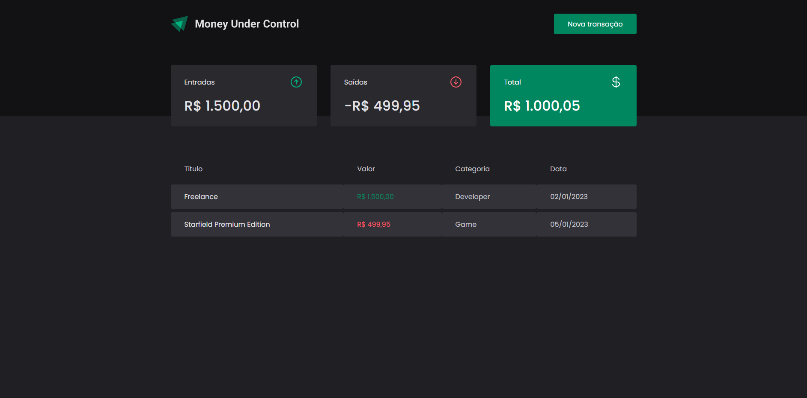
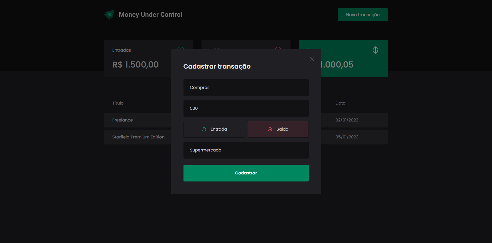
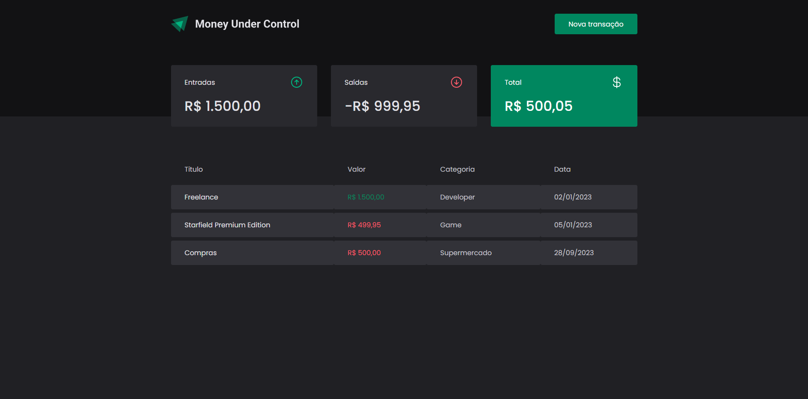

<h2>About the project</h2>
 
A <b>Money Under Control 💰</b> é uma solução eficaz para o controle de finanças pessoais, permitindo que os indivíduos gerenciem suas receitas, despesas e investimentos de forma organizada e consciente. A principal meta é promover uma melhor saúde financeira, auxiliando os usuários a economizar dinheiro, evitar dívidas desnecessárias 

Credits for the design goes to <a href='https://www.figma.com/community/file/1138814493269096792'>By Rocketseat and Millena Kupsinskü Martins</a>

👉 Live Demo: <a href='#'>Live Demo</a>

<h3>🔧 Tools:</h3>

» React JS 
» TypeScript 
» Styled Components

<h2>Screenshots of the Project 📸</h2>
 
<h3 align='center'>Home Page 🏡</h3>

